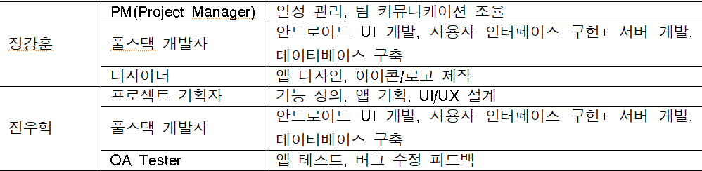

# 🏃ELSA
어르신 활력 프로젝트
Empowering Lives for Senior Activity

✅TEAM

✅Description

ELSA는 어르신들이 쉽고 안전하게 건강을 관리할 수 있도록 돕는 스마트 헬스케어 앱입니다.
현대 사회에서 고령화가 빠르게 진행되면서, 어르신들의 자가 건강 관리가 점점 더 중요해지고 있습니다.
하지만 기존의 건강 관리 방식은 병원 방문이나 보호자의 직접적인 도움이 필요하여 어르신들이 
스스로 건강을 챙기기 어려운 한계가 있습니다.ELSA는 이러한 문제를 해결하기 위해 개발된 앱으로, 
스마트 기술을 활용하여 어르신들이 더욱 건강하고 안전한 삶을 누릴 수 있도록 지원합니다.

✅Main Fuctions
1. 맞춤형 운동 추천 시스템
-아픈 부위별 맞춤 운동을 추천하여 건강한 생활 지원
-영상 가이드 제공을 통해 어르신들이 쉽게 운동을 따라 할 수 있도록 지원
2. 동기 부여 및 지식 제공
-사용자가 앱을 실행 또는 로딩 화면을 볼 때 운동 및 건강 관련 동기부여 문구를 제공
